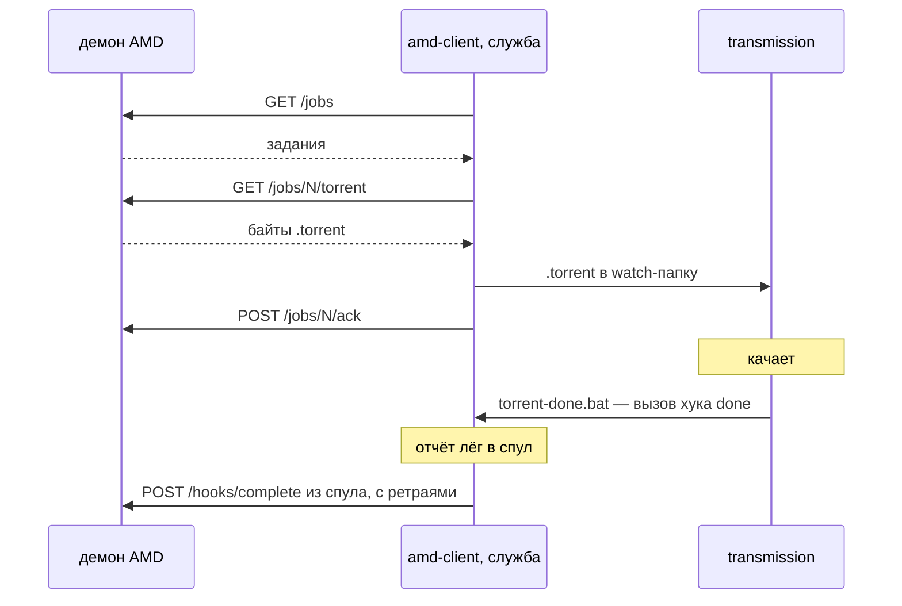

Скачивающий клиент [auto-media-downloader-server](https://github.com/3axapp/auto-media-downloader-server). Забирает
задания у демона, кладёт `.torrent` в watch-папку transmission и отчитывается о результате скачивания.

## Как это работает



Хук `done` не ходит в сеть: он кладёт отчёт в спул, а доставляет его служба.
Поэтому недоступный демон или перезагрузка Windows отчёт не теряют.

Связь задания с торрентом — по имени контента: `torrentName` без `.torrent`
совпадает с `TR_TORRENT_NAME`, который transmission передаёт хуку.

## Сборка

```bash
make build-windows     # dist/amd-client.exe
make test              # тесты
```

## Установка на Windows

1. Скопировать `amd-client.exe`, например в `C:\Program Files\amd-client\`.
2. Создать `C:\ProgramData\amd-client\config.json`:
    ```json
    {
      "base_url": "http://nas.local:8080",
      "api_token": "тот же, что в API_TOKEN демона",
      "watch_dir": "C:\\torrents\\watch",
      "poll_interval": "5m",
      "jobs_per_poll": 5,
      "download_timeout": "72h",
      "http_timeout": "30s",
      "log_level": "info"
    }
    ```
3. Проверить настройки - из консоли, без установки службы:
    ```
    amd-client.exe check -config C:\ProgramData\amd-client\config.json
    ```
4. Установить службу (командная строка **от администратора**):
    ```
    amd-client.exe install -config C:\ProgramData\amd-client\config.json
    sc start amd-client
    ```
    `install` создаёт службу с автозапуском, настраивает журнал событий, кладёт
    `C:\ProgramData\amd-client\torrent-done.bat` и печатает строки для настройки
    transmission.
5. Настроить transmission — **при остановленном transmission** вписать в его
   `settings.json`:
    ```json
    "script-torrent-done-enabled": true,
    "script-torrent-done-filename": "C:\\ProgramData\\amd-client\\torrent-done.bat"
    ```
    Transmission перезаписывает `settings.json` при выходе, поэтому правка на ходу
    теряется.

### Установка службы вручную

Если не хочется полагаться на `install`:

```
sc create amd-client ^
  binPath= "\"C:\Program Files\amd-client\amd-client.exe\" run -config \"C:\ProgramData\amd-client\config.json\"" ^
  start= auto ^
  DisplayName= "auto-media-downloader client"
sc failure amd-client reset= 86400 actions= restart/60000/restart/60000/restart/60000
sc start amd-client
```

Обёртку для transmission в этом случае надо создать самому —
`C:\ProgramData\amd-client\torrent-done.bat`:

```bat
@echo off
"C:\Program Files\amd-client\amd-client.exe" done -config "C:\ProgramData\amd-client\config.json"
```

## Удаление

```
sc stop amd-client
amd-client.exe uninstall
```

Конфиг, состояние и логи остаются на месте.

## Команды

| Команда                 | Назначение                                                                  |
|-------------------------|-----------------------------------------------------------------------------|
| `run`                   | Рабочий цикл. Под SCM работает как служба, из консоли — как обычный процесс |
| `done`                  | Хук transmission: записать отчёт в спул                                     |
| `check`                 | Проверить конфиг, связь с демоном, токен и права на запись                  |
| `install` / `uninstall` | Регистрация и удаление службы                                               |
| `version`               | Версия                                                                      |

Общий флаг `-config` ставится **после** команды.

## Файлы

```
C:\ProgramData\amd-client\
  config.json            настройки
  state.json             связь имени контента с заданием
  spool\                 отчёты, ожидающие доставки
  logs\amd-client.log    лог с ротацией (10 МБ × 3)
  torrent-done.bat       обёртка для transmission
<watch_dir>\
  .amd-tmp\              временные файлы до атомарного переноса
```

## Переменные окружения

Любое поле конфига переопределяется переменной `AMD_*`:
`AMD_BASE_URL`, `AMD_API_TOKEN`, `AMD_WATCH_DIR`, `AMD_POLL_INTERVAL`,
`AMD_JOBS_PER_POLL`, `AMD_DOWNLOAD_TIMEOUT`, `AMD_HTTP_TIMEOUT`,
`AMD_LOG_LEVEL`.

Удобно, чтобы не держать токен в файле.

## Разбор неполадок

**Торренты не появляются в watch-папке.** `amd-client.exe check` — проверит
связь с демоном и токен. Дальше `logs\amd-client.log`.

**Закачки идут, но уведомлений в Telegram нет.** Значит `done` не вызывается
transmission или отчёты не уходят. Проверить, что в спуле копятся файлы:
если копятся — проблема в связи с демоном, если пусто — transmission не
вызывает `torrent-done.bat` (`script-torrent-done-enabled` и путь в
`settings.json`).

**В логе «отчёт по неизвестному торренту».** Имя контента не нашлось в
`state.json`. Штатно для торрентов, добавленных в transmission помимо
клиента. Если это релиз LostFilm — значит раздача многофайловая, и ключ по
имени для неё не работает.

**Задание помечено `failed` на стороне демона.** `GET /jobs` выдаёт задание
не больше `MAX_ATTEMPTS` раз. Если клиент долго не мог забрать торрент,
демон бракует задание сам.