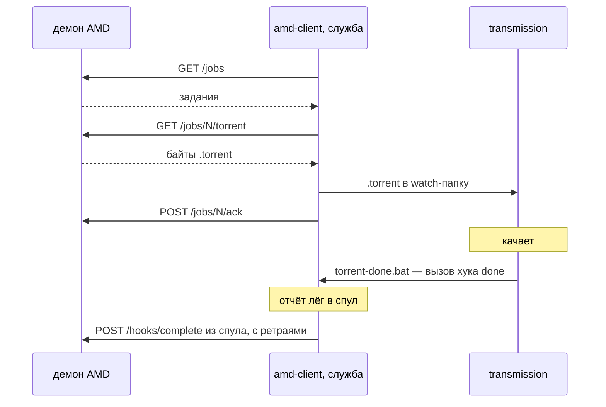

Скачивающий клиент [auto-media-downloader-server](https://github.com/3axapp/auto-media-downloader-server). Забирает
задания у демона, кладёт `.torrent` в watch-папку transmission и отчитывается о результате скачивания.

## Как это работает



Хук `done` не ходит в сеть: он кладёт отчёт в спул, а доставляет его служба.
Поэтому недоступный демон или перезагрузка Windows отчёт не теряют.

Связь задания с торрентом — по имени контента: `torrentName` без `.torrent`
совпадает с `TR_TORRENT_NAME`, который transmission передаёт хуку.

## Сборка

```bash
make build-windows     # dist/amd-client.exe
make test              # тесты
```
